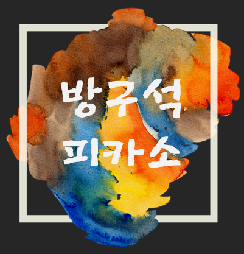
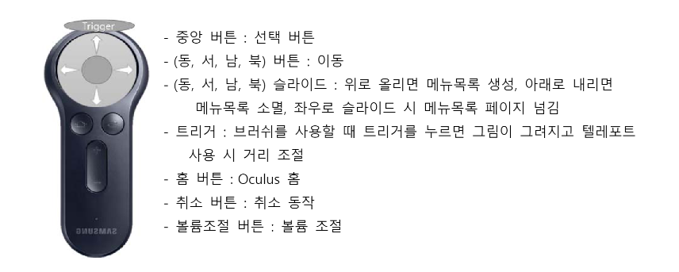
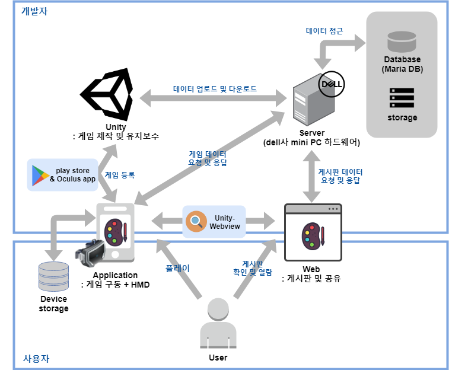
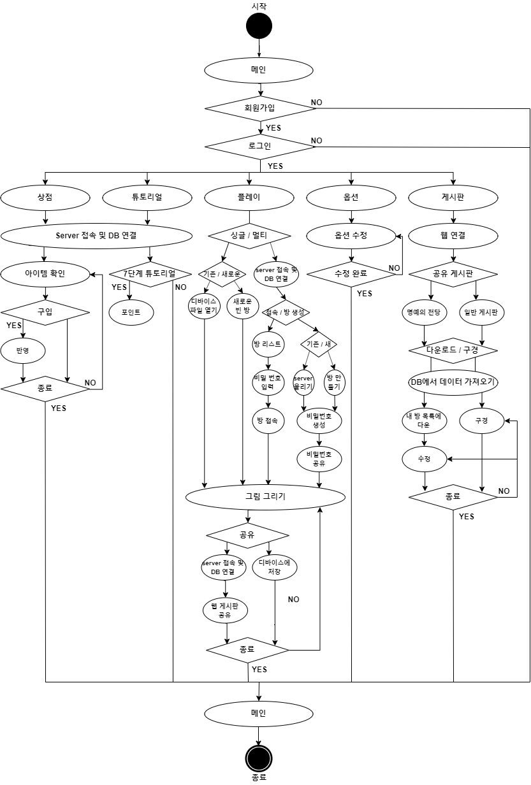

# 방구석피카소

</img>

캡스톤 프로젝트로, Unity 기반 VR용 그림 툴 어플리케이션

현실에서는 창작자의 상상력과 창의력을 제한시킬 수 있는 장소나, 장비와 같은 제약이 있다. 따라서 VR을 사용해 제약이 없는 자신만의 가상 공간을 제공하고, 평면을 넘어 한 차원 높은 3차원에서 그림을 그릴 수 있게 함으로써 자신의 상상력을 더 자유롭게 구체화 시켜 표현할 수 있게 한다. 

## Video

  
  
   ▲ 이미지 클릭 시, 유튜브 작품 발표 영상으로 연결됨

## How to Use
1. 필요 장비
  * 삼성 전자 기어 VR (SM-R3250)
  * C 타입 안드로이드 폰

2. 조작법

</img>

## Configuration

</img>

## Flow chart

</img>

## Demo App
https://drive.google.com/file/d/1q3ftCEb5k4WWoOx4qWqepxsfadT7EUec/view?usp=sharing
